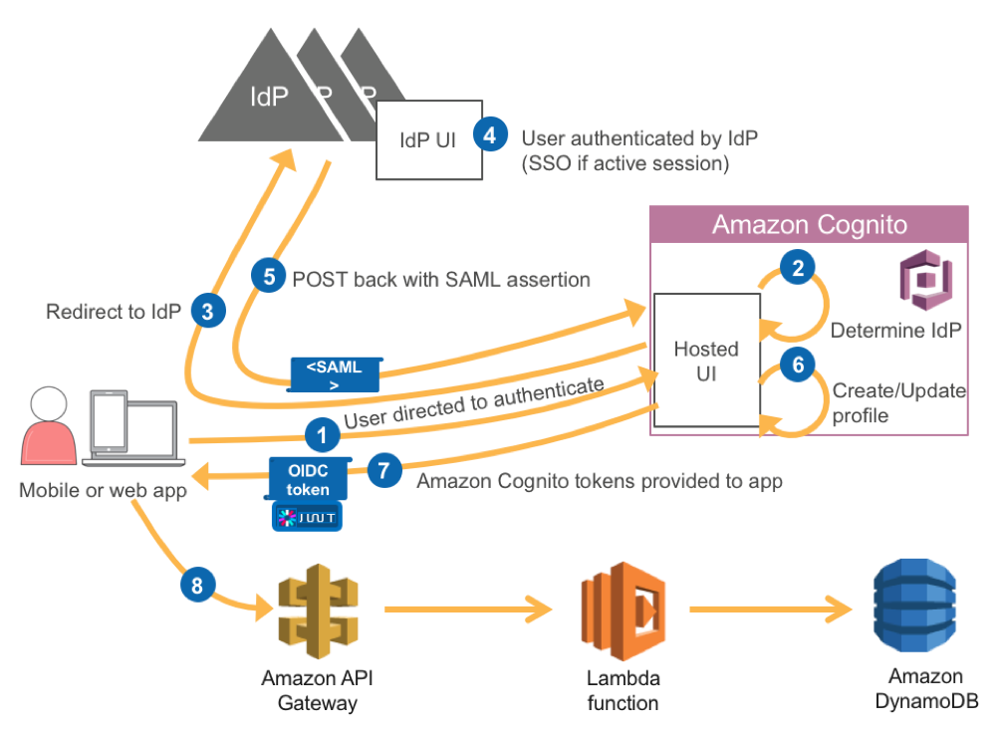

# Building ADFS federation for your Web app using Amazon Cognito User Pools

In this post, we show how to federate identities from Active Directory to authenticate users into your web app by leveraging AWS services. The main AWS service that we will leverage for this purpose is Amazon Cognito user pools. With Amazon Cognito user pools, you can seamlessly add user sign-up and sign-in to your mobile and web apps using a secure and scalable user directory. In addition, you can federate users from a SAML IdP with Amazon Cognito user pools, map these users to a user directory, and get standard authentication tokens from a user pool after the user authenticates with a SAML IdP.

More specifically, we explain how to integrate Amazon Cognito User Pools, together with Active Directory Federation Services, to obtain JWT tokens in your web app that in turn can be used for downstream authentication. To demonstrate the end to end authentication flow we have created a simple REST API built on Amazon API Gateway. The REST API retrieves data from a DynamoDB table with the help of an AWS Lambda function. We will use those JWT tokens vended from user pools to authenticate to the REST API which is hosted on API Gateway.

The details of the flow above are as follows:
1.	The app starts the sign-up and sign-in process by directing your user to the UI hosted by AWS. A mobile app can use web view to show the pages hosted by AWS.
2.	User Pool determines the appropriate IdP based on your configuration. For ADFS the IdP is determined by the metadata file or metadata endpoint URL from your SAML IdP. For example, if you use Microsoft Active Directory Federation Service (AD FS), the metadata URL looks like: https://<yourservername>/FederationMetadata/2007-06/FederationMetadata.xml
3.	Your user is redirected to the identity provider.
4.	The IdP authenticates the user if necessary. If the IdP recognizes that the user has an active session, the IdP skips the authentication to provide a single sign-in (SSO) experience.
5.	The IdP POSTs the SAML assertion to the Amazon Cognito service.
6.	The user's profile is created within Amazon Cognito User Pools.
7.	After verifying the SAML assertion and collecting the user attributes (claims) from the assertion, Amazon Cognito returns OIDC tokens (id, access and refresh tokens) to the app for the now signed-in user.
8.	We make a GET request to the API Gateway. In the Authorization header of the GET request we use the id token. On the API Gateway side we have a Cognito Authorizer that will validate the id JWT token.
